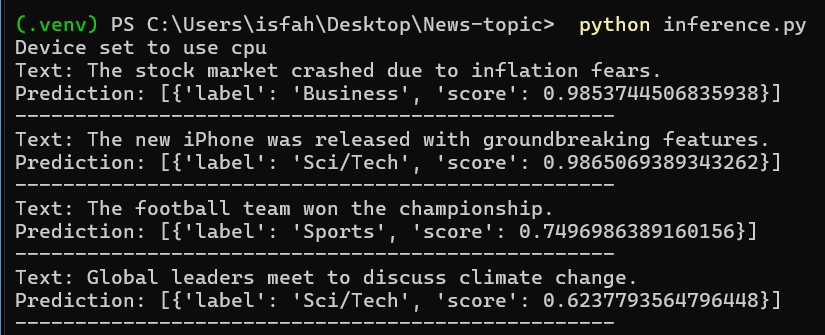
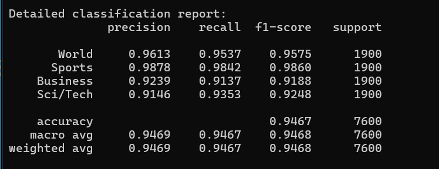

#  News Topic Classifier – BERT + AG News

This project fine-tunes **BERT (bert-base-uncased)** on the **AG News dataset** to classify news headlines into four categories: **World, Sports, Business, and Sci/Tech**.  
It also provides a simple **Gradio app** for live interaction.

---

##  Features
- Fine-tuning BERT on AG News
- Evaluation with **Accuracy** and **Macro F1**
- Gradio web app for headline classification
- Lightweight CLI inference script

---




##  Installation
```bash
git clone https://github.com/<your-username>/news-topic-bert.git
cd news-topic-bert
pip install -r requirements.txt

